## PolkaBind

## Project Overview

[Polkabind](https://github.com/Polkabind/polkabind) - Seamless interaction with any Polkadot SDK based chain for Swift, Kotlin, Javascript, Python and more!

`Polkabind` is a library that opens the Polkadot ecosystem to programming languages other than Rust. It exposes mainly standard wallet-level functionality (key management, balance queries, extrinsic building, signing, RPC, event subscriptions and more) to other languages (Swift, Kotlin, Python, Javascript and more) by exposing Parity's [Subxt](https://github.com/paritytech/subxt) library through FFI (foreign language interface).

`Polkabind` achieves this in a different way: leveraging **Subxt** to other programming languages (the official and established library to interact with Polkadot SDK chains), instead of reinventing it or a subset of its API scope from scratch.

### Project Details

`Polkabind` tries to open the Polkadot ecosystem to other languages in a smart way by: 

- **creating a Rust façade/abstraction on top of Subxt itself**: we use Subxt, we don't replace it. Subxt is our source of truth. The façade exposes mainly standard wallet-level functionality, developed in *Rust*, the language Subxt is developed in, achieving absolute compatibility with Subxt's API and data types.
- **simplifying the developer experience**: instead of crafting a big block of code using Subxt to do a simple transfer, Polkabind abstracts it to be a simple function exposed to other languages.
- the façade is ported to other languages through FFI (C ABI), the standard bridge between Rust and most runtimes. Polkabind uses [Mozilla's UniFFI](https://mozilla.github.io/uniffi-rs/latest/) to generate foreign-language bindings for the Rust API that the façade exposes, instead of annotating Subxt's code itself, this way we achieve real separation of concern between our code (Polkabind API) and code we depend on (Subxt).
- Polkabind will produce small ready-to-import libraries for major languages: Swift, Kotlin, Nodejs, Python and more. And later, those libraries will be published to each language package manager's repository: for Nodejs, it will be as simple as *npm install @polkabind/latest*. 
- If Polkabind API is impacted by some Subxt update, a simple update to Polkabind automatically propagates to every supported language through our CI, producing updated packages.

`Polkabind` **is not** a **Subxt** replacement, nor it tries to reimplement it or a subset of its features in other languages.

`Polkabind` **is three things**: 
    1. a native binary that leverages Subxt wrapped by Polkabind's developer oriented API (façade). 
    2. a library in the foreign language generated to stand as a communication medium between client code in the foreign language and the binary.
    3. a CI pipeline, that packages and pushes ready to import packages for every supported language automatically on every push on the Polkabind main repository.

```mermaid
flowchart TB
  subgraph Polkabind["Polkabind"]
    direction TB
    A1[Uses Subxt under the hood]:::concept
    A2[Exposes a simple developer-oriented API/façade]:::concept
    A1 --> A2
  end

  subgraph Components["Polkabind Consists Of"]
    direction TB
    B1[Native binary = Rust façade + Subxt]:::component
    B2[Generated foreign-language library FFI bindings]:::component
    B3[CI pipeline Auto-package & publish]:::component
  end

  subgraph CI["CI Pipeline"]
    direction TB
    C1[On push to main repo]
    C2[Build binary & generate bindings]
    C3[Create and tag language packages]
    C4[Publish packages to registries]
    C1 --> C2 --> C3 --> C4
  end

  Polkabind --> Components --> CI

  classDef concept fill:#fff4e5,stroke:#ffa726,stroke-width:1px;
  classDef component fill:#e3f2fd,stroke:#42a5f5,stroke-width:1px;
```
    



#### PoC and High-Level Workflow

Polkabind in its current state is a fully functional PoC that leverages Subxt coupled with a simple façade, and Swift bindings, all in a light Swift Package ready to be imported (via URL or downloaded in local) in Xcode in any iOS project.

The whole process is **fully automated** and triggers on every new tag (version) push to the Polkabind repository:

- compiling the binary that contains Subxt + the Rust façade, for every supported platform (currently iOS).
- generating bindings for target languages (currently Swift).
- versioning and packaging the result into target languages packages (currently Swift Packages), where each package is pushed into its own repository, so it can be imported just by pointing the package manager to the package's Github repository.

This is a high level workflow showcasing the production of a Swift Polkabind package:

```mermaid
flowchart TD
  %% ──────────────────────────────────────────────
  %%  Repositories (left-to-right data flow)
  %% ──────────────────────────────────────────────
  subgraph CORE["**polkabind**  (Rust + Subxt façade)"]
    A[Push / Tag vX.Y.Z]
  end

  subgraph CORE_CI["Core repo CI  ( GitHub Actions )"]
    direction LR
    B1[Build<br/>⚙️ Rust dylib<br/> device + sim] --> B2[Generate Swift stubs<br/>🔧 UniFFI]
    B2 --> B3[Bundle xcframework<br/>+ Package.swift]
    B3 -->|git push files & tag| B4[Mirror into<br/>**polkabind-swift-pkg**]
  end

  subgraph SWIFT_REPO["**polkabind-swift-pkg**  (repo)"]
    C[New commit<br/>+ tag vX.Y.Z]
  end

  subgraph SWIFT_CI["Swift repo CI  ( GitHub Actions )"]
    D1[Zip package] --> D2[Create GitHub Release<br/>📦 polkabind-swift-pkg.zip]
  end

  subgraph CONSUMER["Developer / CI using SwiftPM"]
    E[Swift / iOS App<br/>adds SPM dependency<br/>→ fetches Release]
  end

  %% ──────────────────────────────────────────────
  %%  Link everything
  %% ──────────────────────────────────────────────
  A --> CORE_CI
  B4 --> C
  C --> SWIFT_CI
  D2 --> E

  %% ──────────────────────────────────────────────
  %%  Styling helpers
  %% ──────────────────────────────────────────────
  classDef repo      fill:#f9f9f9,stroke:#bbb;
  classDef pipeline  fill:#eef3ff,stroke:#87a9ff;
  classDef release   fill:#e8fce8,stroke:#78c878;

  class CORE,SWIFT_REPO repo
  class CORE_CI,SWIFT_CI pipeline
  class D2 release
  ```
  
#### The tutorial

The [Polkabind repository](https://github.com/Polkabind/polkabind) features an example iOS app that does a simple token transfer. The app doesn't contain the Polkabind Swift package, so the user can import it as any Swift Package through Xcode and the SPM (Swift Package Manager). A step by step tutorial on how to achieve that is in the Polkabind README, illustrated with screenshots.

### Ecosystem Fit

Polkabind's feature scope is precise: giving developers in target languages an ergonomic way to develop **wallet-level** functionality for Polkadot. Any tool that needs to interact with a Polkadot SDK based chain in a language (that Polkabind supports) other than Rust can just import the corresponding Polkabind package, and get access to a simple and ergonomic API.

As of today, many projects and endeavors in the ecosystem try to implement native libraries for other programming languages than Rust, to interact with Polkadot SDK based chains, and we can name a few: [Novasamatech's](https://github.com/novasamatech) [Swift SDK](https://github.com/novasamatech/substrate-sdk-ios) and (Kotlin SDK)[https://github.com/novasamatech/nova-wallet-android], [py-polkadot-sdk](https://github.com/JAMdotTech/py-polkadot-sdk), and even projects being funded by this very grant. Those projects are doing great job opening the Polkadot ecosyste mto other developer communities; but it comes with a cost:

- Safety may be at risk: Cryptographic libraries are not interchangeable between programming languages, no one can guarantee that cryptographic outputs from each of those languages are the absolute equivalent to the Rust based cryptographic primitives used in Polkadot SDK. Same goes for SCALE encoding.

- SDKs implemented in those languages are subject to interpretation and programming styles, which is not a bad thing, but as for cryptography, it may be the origin for intrinsic and subtle bugs in an extreme environment such as the blockchain.

- Keeping those SDKs in par with the official ones (Polakdot SDK itself, Subxt etc) is a huge task itself, there's no substitute for dedication to keep up with the upstream libraries and testing rigorously.

I've learned from the classes I took in PBA (Polkadot Blockchain Academy) about the full potential of **Subxt** and why it was initiated (along with *Smoldot*) by Parity: the community needed a Rust based library that gives developers a robust way to interact with Polkadot SDK based chains while guaranteeing type safety and cryptographic homogeneity by using the same core cryptographic Rust primitives used in Polkadot SDK itself.

*Subxt* is what makes *Polkabind* unique: instead of reinventing the wheel, why not leveraging Subxt to other languages, no room for interpretation, no room for reimplementation, only one source of truth which is Subxt, wrapped nicely for other languages.

#### The back story

Packaging Rust binaries as libraries that can be imported by other languages was a subject I was passionate about even before my interest in Polkadot. After the PBA Lucerne, I was fully aware of the potential of *Subxt* and I started researching ways to package it for other languages, and if it's a good alternative to libraries developed from scratch.

This issue from the [Smoldot](https://github.com/paritytech/smoldot/issues/1453) project made it clear for me that many Rust centric and widely used libraries in the ecosystem are trying to find ways to be imported and used in other environments (i.e, other languages' runtimes) without sacrificing the type safety that Rust guarantees.

Then came this issue for [Subxt](https://github.com/paritytech/subxt/issues/1913#issuecomment-3018427171), where the lead maintainer of the project expressed something similar: they wanted an example of how we can bind Subxt to other languages, in order to open it for the wider developer community. In order to validate the idea behind `Polkabind`, I jumped in and I worked on an example use case of exposing Subxt to Nodejs and Python. My proposal for that issue was greatly welcomed and it was [merged](https://github.com/paritytech/subxt/tree/master/examples/ffi-example). 

This gave me confidence in my idea. But I didn't stop there, I wanted to explore if a similar idea was developed in other Web3 communities. I discovered the [uniffi-zcash-lib](https://github.com/eigerco/uniffi-zcash-lib), a project that received two big grants from the Zcash community: they did the same thing to expose the *Zcash* Rust core library to other language communities. I studied the project, and found a problem with their approach: they use Mozilla's UniFFI toolkit to generate bindings for foreign languages which is great, but they have chosen to annotate the *Zcash* core library itself in order to generate the binding, meaning that they maintain their own version of the Zcash library, here'sthe drawbacks:

- Divergence from upstream: Every time the Zcash maintainers release bug-fixes or performance improvements, they will have to manually merge those changes into your fork leading to increased upgrade burden and merge conflicts.
- Violation of the single source of truth: By embedding the FFI annotations directly into the Zcash code, they’re mixing two separate concerns, core protocol implementation and language-binding glue all in one codebase.
- Annotation bloat and readability.

This made it clear for me that exposing a separate API/façade on top of *Subxt* is the clean solution: one untouchable source of truth (Subxt) and an ergonomic and simple API on top of it, all in one binary.

## Team

- **Team Name:** For now it's a solo-project, lead by me: Wassim Mansouri.
- **Contact Name:** Wassim Mansouri.
- **Contact Email:** wassim@polkabind.dev
- **Website:** 
  https:://polkabind.dev 
  https://wassimans.com.

### Team members

Wassim Mansouri

#### LinkedIn Profiles (if available)

- https://www.linkedin.com/in/wassimans

### Team Code Repos

- https://github.com/Polkabind
- https://github.com/Polkabind/polkabind
- https://github.com/Polkabind/polkabind-swift-pkg

Please also provide the GitHub accounts of all team members. If they contain no activity, references to projects hosted elsewhere are also fine.

- https://github.com/wassimans

### Team's experience

I'm a software engineer with more than ten years of professional experience. I'm based in France. I've worked for various French startups mainly in Web2 projects.

My interest for Web3 began about two years ago, I took a class here in France to learn about blockchain development in the EVM, then discovered Polkadot and Substrate and was hooked ever since.

I got the chance to work as contractor protocol developer on the [Archtehic project](https://www.archethic.net), a project that is discontinued, then right after that, I joined and graduated from the Polkadot Blockchain Academy in Lucerne 2025, and that marked my full commitment for the Polkadot community.

Right after the PBA, and due to my experience working with the Elixir programming language in a blockchain project (Archtehic), I was accepted by the [Jamixir](https://github.com/jamixir) team to contribute to the project, which is a *JAM* implementation in Elixir. I had the chance to get many of my PRs merged (currently all JAM implementation repositories are private as per the JAM protocol development guidelines).

I also contributed to the Polkadot SDK (https://github.com/paritytech/polkadot-sdk/pull/8351#issuecomment-2854122316).

And through my passion for software engineering, Web3, Polkadot and the Rust programming language, I wanted to start a project that helps the community go stronger and that gives a sense to my efforts: Polkabind.

## Development Status

As mentioned before, [Polkabind](https://github.com/Polkabind/polkabind) started with a community expressed need, and is now a fully implemented and tested PoC that publishes a ready to use Swift package that exposes a simple token transfer functionality.

## Development Roadmap

This is the overall scope of wallet-level API that Polkabind aims to deliver by the end of a three-month duration. The API will be developped in Rust, using Subxt under the hood, and exposed to Swift and Kotlin.

| Category               | Feature / Task                           |
|------------------------|------------------------------------------|
| **Account**            | Generate mnemonic                        |
|                        | Derive seed                              |
|                        | Import JSON keystore                     |
|                        | Export JSON keystore                     |
|                        | Decode derivation path                   |
| **Address**            | SS58 encode                              |
|                        | SS58 decode                              |
| **Balance**            | Query balance                            |
|                        | Subscribe to balance changes             |
| **Transfer**           | Submit a transfer                        |
|                        | Track extrinsic status                   |
| **Staking**            | Bond funds                               |
|                        | Unbond funds                             |
|                        | Nominate validators                      |
|                        | Withdraw unbonded                        |
| **Subscription**       | RPC connect                              |
|                        | RPC disconnect                           |
|                        | JSON-RPC request                         |
|                        | Subscribe to storage changes             |
| **Metadata**           | Fetch runtime metadata                   |
| **Fees & Dry-Run**     | Estimate transaction fee                 |
|                        | Perform dry-run (payment query)          |
| **Multisig**           | Create multisig call                     |
|                        | Approve multisig                         |
|                        | Execute multisig                         |
| **Batch**              | Batch multiple calls                     |
| **Governance**         | Submit democracy proposal                |
|                        | Vote on referendum                       |
| **Assets & Tokens**    | Transfer arbitrary asset                 |
|                        | Query asset balance                      |
| **Chain Info**         | Get chain properties                     |
|                        | Get runtime version                      |
| **Events**             | Subscribe to system events               |
| **Block & Heads**      | Subscribe to new heads                   |
|                        | Fetch block by hash                      |
| **Nonce & Account**    | Query account nonce                      |
|                        | Query account info                       |
| **Genesis & Chain**    | Get genesis hash                         |
|                        | Get chain name                           |
| **Utility**            | Decode SCALE bytes                       |
|                        | Encode to SCALE bytes                    |

### Overview

- **Estimated Duration:** 3 months
- **Full-Time Equivalent (FTE):**  3.0 FTE (three 1 FTE-month)
- **Total Costs:** 30,000 USD

| Number | Deliverable | Specification |
| -----: | ----------- | ------------- |
| 0a. | License | Apache 2.0 (dual-licensed MIT/Apache optional).|
| 0b. | Documentation | We will provide:
  </br> **Inline documentation** in Rust (`///` comments) covering every public API, published on docs.rs.
  </br> **Generated API reference** for Swift (DocC) and Kotlin (KDoc/Javadoc), automatically built and published via our CI pipeline (GitHub Pages or similar). 
  </br> A **step-by-step tutorial** showing how to import the Polkabind Swift and Kotlin packages into the provided example iOS and Android apps and perform some operations.|
| 0c. | Testing & Testing Guide | Rust unit tests cover every façade function and error path, Swift (XCTest) & Kotlin (JUnit) binding tests drive the generated APIs, and a guide describing how to run all tests locally.|
| 0d. | Docker | We will provide a Dockerfile that spins up: a Chopsticks local Polkadot dev node (Instant finality), and runs Rust, Swift and Kotlin tests against that node.|
| 0e. | Article | We will publish an **article** giving a 360° overview of Polkabind, its architecture, and a complete tutorial of how to develop a basic native app wallet targeting Polkadot with Polkabind. |
| 1.  | Core API + Swift/Kotlin bindings + sample apps + CI + tests + Docs | Implement & expose Rust façade for: Account, Address, Balance, Transfer, Subscription, Metadata, Fees & Dry-Run. Generate and publish Swift & Kotlin packages (xcframework & Maven). Corresponding tests, docs and sample apps features.|
| 2.  | Advanced API + Swift/Kotlin bindings + sample apps + CI + tests + Docs  | Implement & expose Rust façade for: Add Staking, Multisig, Batch, Governance, Assets & Tokens, Chain Info, Events, Block & Heads, Nonce & Account, Genesis & Chain, Utility helpers. Generate and publish Swift & Kotlin packages (xcframework & Maven). Corresponding tests, docs and sample apps features. |

### Budget Breakdown (Example, please adapt)

| Category   | Item                       | Cost   | Amount  | Total          | Description                                     |
|------------|----------------------------|--------|---------|----------------|-------------------------------------------------|
| Personnel  | Lead Developer / DevOps    | 10,000 | 1,5 FTE | 15,000         | Rust API, Swift & Kotlin bindings, CI pipelines |
| Personnel  | Mobile Developer           | 10,000 | 1.0 FTE | 10,000         | Example iOS and Android apps                    |
| Personnel  | QA Engineer                | 10,000 | 0.5 FTE | 5,000          | Tests, documentation                            |
| —          | —                          | —      | —       | **30,000 USD** |                                                 |


## Future Plans

- how you intend to finance the project's long-term maintenance and development:
   - more grants: this initial grant will cover the core 3-month roadmap and lay down the core value of Polkabind, but more grants are certainly needed to enlarge the feature set (more languages).
   - consulting & support: I’ll offer paid integration support and custom feature work, with revenues plowed back into the project.
   - the project is currently a solo endeavor for stability reasons; once the v1 (hopefully supported by this grant) is reached, I have a couple of fellow PBA students that would love to be part of the project.
- how you intend to use, enhance, and promote your project in the short term:
  - "dogfooding": I plan to reimplement [Polkadot Vault app](https://wiki.polkadot.network/general/polkadot-vault/) using Polkabind.
  - content: I’ll write a series of blog posts (on polkabind.dev) and give talks/workshops at Polkadot meetups.
  - community engagement: open "good first issue" tags on GitHub.
- the team's long-term plans and intentions in relation to it:
  - language expansion: support every language Mozilla's UniFFI support (Javascript, Python, Ruby, C# and more).
  - ecosystem integration: finding ways to promote the project so Polkabind becomes the canonical multi-language SDK.

