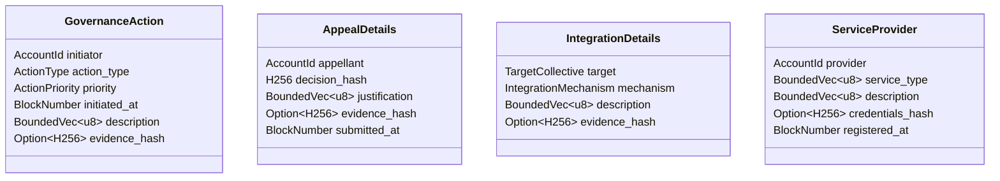

# Polkadot Ambassador Fellowship Governance Extension Pallet

## Project Overview

- **Tagline:** A comprehensive governance framework enhancement for the Polkadot Ambassador Fellowship
- **Brief Description:** The Ambassador Governance Extension Pallet implements additional governance capabilities for the Polkadot Ambassador Fellowship, including structured decision-making processes, appeal mechanisms, cross-collective integration, progressive discipline approaches, and transparency enhancements.
- **Integration with Polkadot:** This pallet will be integrated into the Collectives parachain, enhancing the governance capabilities of the Polkadot Ambassador Fellowship collective within the Polkadot ecosystem.
- **Team Interest:** Our team is committed to strengthening Polkadot's governance infrastructure by providing robust, transparent, and effective governance mechanisms that align with the Polkadot Ambassador Fellowship's manifesto and the broader Polkadot on-chain readiness assessment framework.

### Project Details

#### Technology Stack
- Substrate FRAME pallets
- Rust programming language
- Polkadot SDK

#### Core Components
1. **Identity Verification System**
  - Integration with `pallet_identity` to verify ambassador identities
  - Implementation of the `IdentityVerifier` trait to enhance accountability

2. **Rank-Based Authorization**
  - Implementation of the `RankChecker` trait to enforce appropriate rank requirements
  - Integration with `pallet_ranked_collective_ambassador` for rank verification

3. **Structured Decision-Making Framework**
  - Mechanisms for coordinated responses to various governance situations
  - Committee formation and resolution processes with appropriate checks and balances

4. **Appeal and Remediation Process**
  - Structured appeal submission and review system
  - Committee-based decision-making for appeals with appropriate rank requirements

5. **Cross-Collective Integration**
  - Mechanisms for establishing formal relationships between the Polkadot Ambassador Fellowship and other collectives
  - Support for various integration types (joint councils, liaison roles, shared workgroups, etc.)

6. **Professional Service Provider Registry**
  - Registration system for service providers with identity verification
  - Referral framework for professional services with transparency requirements

#### Data Models

Below are simplified representations of the key data structures that will be implemented:

Note: These data models follow the pattern where only evidence hashes (H256 values) are stored on-chain while the actual evidence is stored off-chain. Human-readable parameters include references to where the off-chain evidence is stored for transparency and auditability.

#### What This Project Will Not Provide (Exclusions)

**Important Note:** The success of this grant should not be withheld if the proposer does not proceed with any of these Exclusions.

This grant application explicitly excludes:
- Preparation of the Polkadot On-Chain Readiness Assessment Framework for Collectives that was prepared previously by the applicant and served to identify the needs of the Polkadot Ambassador Fellowship
- Manifesto clarifications, updates, annexes, amendments, or any other changes
- Operational costs such as marketing, events, or audits
- Governance amendment processes (these can be implemented permissionlessly by any entity in the ecosystem)
- Detailed benchmarking and optimization of the pallet for production-level performance since may be very time-consuming and not within the scope of this grant application (this could be a potential follow-up grant opportunity that is specifically focused on benchmarking and optimization of this and other pallets)
- Security audits, formal verification, or other advanced security validation techniques (these would require specialized expertise and significant additional resources beyond the scope of this grant)
- User interfaces for interacting with the governance mechanisms (this grant focuses on the core pallet functionality rather than front-end development)
- Integration with additional collectives and governance systems beyond the Polkadot Ambassador Fellowship (the initial implementation will focus on the Polkadot Ambassador Fellowship's specific needs)
- Only a reasonable amount of unit and integration tests similar to those in other pallets, such that each logical code component should be testable in accordance with https://github.com/PolkadotOpenSourceGrants/delivery/blob/master/delivery-guidelines.md#unit-tests, with a best-effort approach to cover critical functionality, but not exhaustive test coverage for all edge cases (comprehensive edge case testing would typically be part of a formal security audit, which is excluded from this grant)

### Ecosystem Fit

- **Ecosystem Fit:** The Ambassador Governance Extension Pallet enhances the Polkadot governance ecosystem by providing specialized governance mechanisms for the Polkadot Ambassador Fellowship, which plays a vital role in community engagement and ecosystem growth. It would also serve as a model for other collectives to implement similar governance mechanisms, including Decentralized Voices that participate as collectives in the Polkadot ecosystem and wish to transition to on-chain governance rather than using an off-chain governance model with an N-of-M multisig.

- **Target Audience:**
  1. Polkadot Ambassador Fellowship members who need governance tools to fulfill their roles
  2. Parachain developers who need to integrate with Polkadot Ambassador Fellowship governance
  3. Other collectives seeking to establish formal relationships with the Polkadot Ambassador Fellowship

- **Needs Met:**
  1. Transparent and accountable governance for the Polkadot Ambassador Fellowship
  2. Clear processes for handling various governance situations, appeals, and cross-collective collaboration
  3. Identity verification for governance actions
  4. Rank-appropriate authorization for different governance functions

- **Need Identification:** These needs were identified based on raw data collected from their interactions with the Polkadot Ambassador Fellowship since the proposer of this grant application is an actively engaged Rank II member of the Polkadot Ambassador Fellowship and has contributed to iterations of its manifesto. They have consulted with the Polkadot Ambassador Fellowship and analyzed governance requirements outlined in the Polkadot Ambassador Fellowship Manifesto and the Polkadot On-chain Readiness Assessment Framework that they have developed. The proposer also reflects upon their recent experience in Decentralized Voices Cohort IV in the JAM Implementers DAO. They also recently voluntarily published this report [Decentralized Governance Transition Risk Management Framework: A Parallel Storytelling Approach](https://gist.github.com/ltfschoen/eccba1eb9ac12659c951f1a97f8648cb) based on lessons learnt during the migration of the Polkadot Ambassador Fellowship to on-chain governance as an educational document that uses parallel storytelling to illustrate governance principles and best practices. The inspiration was also drawn from the Polkadot On-Chain Readiness Assessment Framework for Collectives that the applicant also developed that is yet to be formally published.

- **Similar Projects:** While there are other governance pallets in the Polkadot ecosystem (such as Democracy, Council, and Treasury), none provide the specialized governance mechanisms required by the Polkadot Ambassador Fellowship with its unique rank-based structure and responsibilities. It may not have been attempted before since it was developed based on gap analysis of the existing governance mechanisms in the Polkadot ecosystem and the needs of the Polkadot Ambassador Fellowship, and requires substantial development effort.

## Team

- **Team Name:** Clawbird Pty Ltd
- **Contact Name:** Luke Schoen
- **Contact Email:** luke@clawbird.com
- **Website:** https://github.com/clawbird

**Company Background:** Clawbird Pty Ltd has been building open-source web3 and Polkadot products and infrastructure for 4+ years, with a vision to build educational tooling for blockchain ecosystems. The team has presented at Polkadot Decoded (2021) and DCxPrague (2023), and is currently investigating zero-knowledge and IPFS solutions.

### Team members

Luke Schoen

#### LinkedIn Profiles

- https://www.linkedin.com/in/ltfschoen/

### Team Code Repos

- https://github.com/ltfschoen

### Team's experience

Our team has extensive experience in developing Substrate pallets and contributing to the Polkadot ecosystem:

**Professional Experience:**
- **Parity Technologies** (Jul 2018 - Jul 2019): Software Developer working on core Polkadot ecosystem projects and presented Parity Fether at Full Node in Berlin in 2019:
  - Polkadot.js
  - Substrate framework
  - Early documentation author for Substrate and Polkadot
  - Parity Ethereum
  - Parity Fether (decentralized light client-based wallet)
- **MXC Foundation** (Feb 2021 - May 2022): Senior Blockchain Developer who launched DataHighway Parachain on Kusama (Polkadot's canary network)
- **JAM Protocol Implementer** (Apr 2024 - Present): Building a TypeScript implementation of the JAM protocol with the Clawbird team

**Recent Contributions:**
- "AND Gate" EnsureOrigin https://github.com/paritytech/polkadot-sdk/pull/9048 to address Polkadot SDK issue https://github.com/paritytech/polkadot-sdk/issues/369 that was a self-directed initiative in 2025
- DevRel Program Lead contractor and hackathon judge with WebZero for Polkadot sponsored tracks at ETHDenver 2025 #BUIDLathon and The Blockspace Mansion in 2025
- DevRel Assistant contractor with WebZero for Polkadot sponsored tracks at Consensys 2024 and The Blockspace Mansion in 2024
- Voluneer that generated the Technical Specification of the Polkadot Ambassador Fellowship Manifesto in Core Contributor Team, OpCom, Genesis Cycle, Polkadot Ambassador Fellowship (Apr 2025)
- Authored the DataHighway Economic Whitepaper https://github.com/DataHighway-DHX/documentation/blob/master/docs/whitepaper/economics/whitepaper-economics.pdf (2021)
- Published "Decentralized Governance Transition Risk Management Framework: A Parallel Storytelling Approach" (Aug 2025)
- Published "Absolute Red: Coretime Economics & Market Stability Considerations" (June 2025)
- Entropretty: Contributed to Dr Gavin Wood's generative art project, including SVG export features, animation support, livereload functionality, and code refactoring (PR #18-22) https://github.com/gavofyork/entropretty/pulls (Jan 2025)

**Governance Experience:**
- Solo delegate representing Web3 Foundation on Kusama OpenGov in Decentralized Voices Cohort II (2024)
- Active participant and member of JAM Implementers DAO on Polkadot and Kusama OpenGov in Decentralized Voices Cohort IV (2025)
- Active participant in governance processes across multiple DAOs, providing practical experience with on-chain governance mechanisms

**Awards and Recognition:**
- Won Zeitgeist's Ecosystem Auxiliary application Bounty Sponsor Challenge for the Polkadot Hackathon: Europe Edition (2023)
- Finalist in Moonbeam Bear Necessities Hackathon (2023)
- High Credit in online Rust exam qualifier for the Polkadot Blockchain Academy (2023)
- Experimented with ink! and XCM: https://github.com/ltfschoen/XCMTemplate (2023)
- Runner-up in Visualisation Bounty Challenge for Build Polkadot: Network Launch hackathon (2020)

**Significant Polkadot Ecosystem Contributions:**

- **Early Documentation Author (2018-2020)**: While working at Parity Technologies, authored some of the first substantial documentation for Substrate and Polkadot, including:
  - Asset pallet documentation: https://github.com/paritytech/substrate/pull/1945/files
  - Democracy pallet documentation: https://github.com/paritytech/substrate/pull/2286/files
  - Multiple contributions to the initial conceptual documentation on the Substrate Developer Hub including substantial early contributions to the Polkadot Glossary that forms the foundation of terminology used today and FRAME reference documentation

- **Technical Community Support**:
  - Top 10% contributor to Substrate & Polkadot StackExchange in its first year after launch, providing detailed technical explanations
  - Multiple open-source contributions including [Polkadot.js Extension issues](https://github.com/polkadot-js/extension/issues?q=is%3Aissue%20author%3Altfschoen) to resolve user-facing wallet issues affecting multiple parachains
  - Provided feedback on the Polkadot Technical Fellowship manifesto: https://github.com/polkadot-fellows/manifesto/pull/3
  - Contributions to the [Polkadot Wiki](https://github.com/w3f/polkadot-wiki/pulls?q=is%3Apr+author%3Altfschoen+is%3Aclosed)

- **Polkadot Ambassador Program Involvement**:
  - Participated in all evolutions of the Polkadot Ambassador Program since its inception, providing education and onboarding to newcomers interested in Polkadot
  - Developed deep understanding of the Ambassador Fellowship's structure, needs, and governance requirements
  - Built a community following from Ethereum and Polkadot that regularly attends Polkadot ecosystem events

While likely eligible for the initial Polkadot Technical Fellowship seeding due to these contributions, chose to focus on community education and development work rather than pursuing Technical Fellowship membership at that time.

## Development Status

The Ambassador Governance Extension Pallet is in the conceptual design phase. We have conducted extensive research on governance requirements for the Polkadot Ambassador Fellowship and have designed the architecture for the pallet based on these requirements.

This project would build upon and extend the work started in https://github.com/polkadot-fellows/runtimes/pull/736, which introduced the initial framework for the Ambassador Governance Extension Pallet. While I did not author that PR, the grant would allow me to build upon this foundation to develop all the components outlined in this proposal.

Research conducted includes:
- Analysis of the Polkadot Ambassador Fellowship Manifesto
- Review of existing governance mechanisms in the Polkadot ecosystem
- Consultation with Polkadot Ambassador Fellowship members on governance needs
- Evaluation of identity verification and rank enforcement requirements

Preliminary work has already been completed, including architecture design, evidence handling pattern development, and proof-of-concept implementations of key components. This preparatory work makes the proposed timeline feasible while still ensuring high-quality deliverables.

## Development Roadmap

### Overview

- **Estimated Duration:** 6 weeks
- **Work Arrangement:** Independent Contractor
- **Total Costs:** 11,880 USD

| Number | Deliverable | Specification |
| -----: | ----------- | ------------- |
| 0. | **Documentation** |
  - a. **License**: GPL-3.0
  - b. **README.md**: Comprehensive documentation covering setup, usage, Docker setup, security features, configuration, and architecture diagrams.
  - c. **Technical Article**: Included directly in the README.md with UML diagrams (class, sequence, flowcharts) illustrating architecture, evidence handling, identity verification, rank enforcement, and integration details. The content of this technical article will also be published as a remark on-chain on the Polkadot relay chain using the System pallet's `remark` extrinsic, with the hash referenced in the README.md. Additionally, the applicant will post a summary of the article on their X account to increase visibility and engagement with the Polkadot community.
  - d. **Testing and Testing Guide**: Core functions will be fully covered by unit tests to ensure functionality and robustness. Tests will include verification of identity checks, rank enforcement, and all governance mechanisms. The guide will explain how to run these tests.
  - e. **CI Compliance**: All code will pass the relevant repository's CI checks including clippy, fmt, and automated tests in `.github/workflows`.
  - f. **Integration Tests**: Basic integration tests will be added to `/integration-tests/zombienet` to verify the pallet's functionality in a simulated network environment.
  - g. **Inline Documentation**: Rust doc comments for all public functions, types, and modules.
  - h. **Docker Setup**: A `DockerfileAmbassador` and `docker-entrypoint.sh` script for containerized testing and development.
  - i. **Architecture Diagrams**: UML diagrams included in the README.md showing the pallet's architecture and workflows. |
| 1. | **Identity Verification Implementation** | We will create the `identity.rs` file in the collectives-polkadot parachain that implements the `IdentityVerifier` trait for the Ambassador Fellowship. This will enhance accountability for governance actions. |
| 2. | **Ambassador Governance Extension Pallet Core** | We will implement the core functionality of the Ambassador Governance Extension Pallet, including structured decision-making frameworks, appeal processes, and cross-collective integration mechanisms. |
| 3. | **Integration with Collectives Parachain** | We will update `lib.rs` in the collectives-polkadot parachain to integrate the Ambassador Governance Extension Pallet, including proper configuration of identity verification and rank enforcement. |
| 4. | **Professional Service Provider Registry** | We will implement the professional service provider registry and referral framework as part of the Ambassador Governance Extension Pallet. |

### Budget Breakdown

**Budget Rationale:** The budget has been carefully established based on the following considerations:

- **Industry Standards:** Rates are aligned with market rates for specialized Substrate development, while remaining cost-effective compared to commercial blockchain development services.
- **Specialized Knowledge:** The budget reflects the specialized knowledge required for implementing governance mechanisms that address the unique needs of the Polkadot Ambassador Fellowship.
- **Scope Management:** The extensive exclusions list (formal verification, audits, UI development, etc.) allows us to focus on core functionality while keeping costs reasonable.
- **Time Investment:** The 6-week timeline represents a significant commitment to designing, implementing, and documenting a production-ready governance pallet.
- **Self-directed Initiative:** Building on our previous self-directed contributions to the Polkadot ecosystem, such as the "AND Gate" EnsureOrigin implementation.

**Total Grant Request:** 11,880 USD (in DOT)

**Category:** Budget breakdown by milestone and category:

#### Milestone 1: Core Implementation (4 weeks)
| Category | Item | Cost | Description |
| --- | ---- | --- | --- |
| Personnel | Lead Developer | 9,000 USD | Architecture design, core pallet implementation, governance mechanisms, and evidence handling pattern |
| **Milestone 1 Total** | | **9,000 USD** | |

#### Milestone 2: Documentation & Testing (2 weeks)
| Category | Item | Cost | Description |
| --- | ---- | --- | --- |
| Personnel | Lead Developer | 2,880 USD | Test suite development, technical documentation, on-chain publication, Docker setup, UML diagrams, and evidence handling documentation |
| **Milestone 2 Total** | | **2,880 USD** | |

**Total Project Cost: 11,880 USD**

This budget represents a significant value considering the specialized nature of Substrate development and governance implementation. The preliminary work already completed has allowed us to optimize the budget while still delivering a comprehensive solution.

## Future Plans

- **Long-term Maintenance:** We plan to maintain and enhance the Ambassador Governance Extension Pallet through ongoing engagement with the Polkadot Ambassador Fellowship and the broader Polkadot community. Future funding may be sought through OpenGov proposals if significant enhancements are required.

- **Short-term Plans:** After the initial implementation, we will focus on promoting adoption of the pallet within the Polkadot Ambassador Fellowship, providing training and support to ensure effective use of the governance mechanisms.

- **Follow-up Grant Applications:** We may apply for additional open-source grants to fund specific enhancements such as:
  - Comprehensive benchmarking and optimization of the pallet
  - Advanced security features and formal verification
  - Integration with additional collectives and governance systems
  - Development of user interfaces for interacting with the governance mechanisms

## Additional Information

- **Previous Funding:** This project has not been submitted for funding to any other entities.
- **Milestone Delivery:** All milestones will be delivered according to the official [Polkadot Open Source Grant delivery guidelines](https://github.com/PolkadotOpenSourceGrants/delivery/blob/master/delivery-guidelines.md), including proper documentation, code quality standards, and submission procedures.
- **Community Need Evidence:** This project addresses documented governance enhancement opportunities within the Polkadot Ambassador Fellowship. Through direct participation in the Polkadot Ambassador Fellowship since its inception, the applicant has observed areas where additional governance capabilities could benefit the collective, particularly in structured decision-making, appeal processes, and cross-collective integration. Similar governance mechanisms have proven successful in other ecosystems, such as Aragon's dispute resolution system and Colony's reputation-based governance.

The proposed evidence handling pattern (storing hashes on-chain with off-chain evidence references) is inspired by successful implementations in decentralized courts like Aragon Court, which has demonstrated that transparent, verifiable governance decisions can be made efficiently while maintaining auditability. Additionally, the rank-based access control system draws from reputation-based voting systems used by Colony DAO and Gitcoin DAO, where governance power is tied to contributions rather than token holdings alone, which addresses challenges like over-centralization and ensures decisions are made by qualified participants.
- **Open Source Experience:** As detailed in the <a href="#teams-experience">Team's Experience</a> and <a href="#significant-polkadot-ecosystem-contributions">Significant Polkadot Ecosystem Contributions</a> sections, our team has demonstrated extensive commitment to open-source development in the Polkadot ecosystem through direct contributions to core projects, documentation improvements, community support, and self-directed initiatives.
