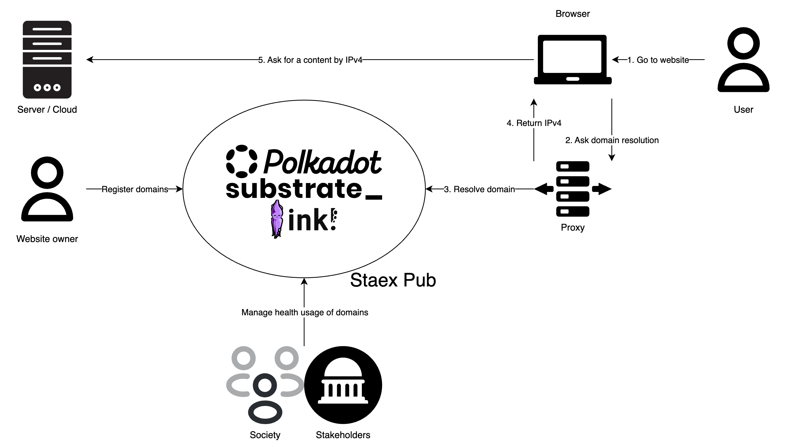

# StaexPub: The Internet for Web3

## Project Overview

### Brief description

The mission of Staex public network (StaexPub for short) is to provide universal worldwide access to crypto and Web3 services, bypassing legacy centralized Internet technologies. StaexPub uses decentralized governance based on economic incentives instead of the governance via state-funded organizations that the current Internet infrastructure is based on. StaexPub runs on top of the Internet, however, it doesn’t rely on any of the legacy technologies except for IP networking and provides fully decentralized Web3-based alternatives to Internet registrars, DNS providers, and certificate authorities. The ultimate objective of the project is to bring Internet registrars into the Web3 economy; they will provide their services at global scale without relying on centralized organizations like IANA.

### Why Polkadot?

The fact that Web3 services are accessed via legacy Web2 Internet infrastructure is an issue that is more and more often brought up by the community. While there are a number of projects that focus on decentralized identifiers (e.g. Kilt on Polkadot), only a few focus on name services (e.g. ENS and eth.limo on Ethereum) and we could not find any that provide alternatives to legacy DNS and certificate authority (CA) systems in terms of decentralized governance and operating system integration. We believe that merely providing a registry of unique names is not enough: Web3 needs underlying infrastructure that is publicly and transparently accessible by the standard Internet browsers and is openly governed by its stakeholders. Our project aims to fill this gap and provide a Web3 version of Internet registrars and certificate authorities implemented as a smart contract (and, in the perspective, DAOs). Polkadot is already the basis of many chains and parachains, and we believe that it is a great fit to provide such foundational services on top and become the backbone of the Web3 Internet.

Video pitch: [https://youtu.be/AL8CFS\_T3Mk](https://youtu.be/AL8CFS_T3Mk)

### Project Details

#### Overview

In this project we are focused on creating an MVP. The system will allow anyone to

* register their own Web3 domain via a smart contract,  
* resolve names via a local DNS resolver (that pulls the data from the blockchain) using legacy DNS queries to seamlessly integrate with browsers and other tools,  
* generate the current list of TLS certificates based on the data from the blockchain via an utility program running locally on the client’s node, and  
* become a registrar — verify that the IP addresses in the certificate belong to the party that signed the purchase transaction and get rewarded for doing that.

The names will be under a unique top-level domain to not interfere with the existing Internet names. Each name is signed by the private key of the owner and is registered in a form of TLS certificate. The locally running client (that bundles local DNS resolver and CA) will allow users to filter the public keys that they trust to browse their own slice of the Internet.

To scale this approach to a large number of DNS names we use registrars as independent certificate verifiers. They check that a user actually owns the IP address specified in the certificate by performing a TLS handshake against it; if the handshake succeeds and the certificate matches the one from the blockchain, then the registrar cross-signs the certificate and sends it to the smart contract. Once the majority of registrars sign the certificate the name becomes trusted by the local resolver automatically. The procedure is repeated periodically, and registrars recall their cross-signed certificates if it fails; as a result the domain becomes untrusted.

The network with registrars provides a number of advantages over the existing Internet.

- New top-level domains would be much easier to register — a matter of the consensus between the registrars.  
- No reliance on government-funded entities for establishing trust.  
- DNS-based attacks (e.g. data exfiltration, cache poisoning) will be rendered impossible by the use of the blockchain and local resolver.

#### Core components

In the current grant we will provide the following components.

* `staex-smart` — smart contracts that implement domain management, registrar management, and other utility functions.  
* `staex-web` — DAPP that provides Web UI for the smart contracts (domain registration and other functions).  
* `staex-local` — local DNS resolver and certificate authority that sources its data from the smart contract’s storage.  
* `staex-registrar` — IP address ownership and TLS certificate verifier.

#### Smart contracts (`staex-smart`)

We will implement smart contracts in the ink\! programming language.

##### Registering a domain (`domain` call)

- The user calls a smart contract with the following parameters.  
  - Signed TLS-like certificate which contains  
    - FQDNs,  
    - IPv4/IPv6 addresses of the server,  
    - start date (no later than in a year),  
    - expiration date (no later than in a year, no sooner than in a month),  
    - BASE32-encoded wallet address as one of the FQDNs.  
  - A wallet address to which the domain should be transferred when expired (none by default). By this time that wallet should submit its own domain registration request for the transfer to happen.  
- Users should, in addition to the domain price, send an appreciative amount of tokens which will be locked until domain expiration date.

##### Updating/deregistering/transferring a domain

Same as domain registration but supply a different expiration date, e.g. the current date to deregister a domain. The locked tokens are returned to the owner. The owner can also claim locked tokens via a separate `claim` call if the domain has expired by itself.

##### Becoming a registrar (`registrar` call)

Registrars check that users actually own the IP addresses for which they register domain names and get a reward for doing that. In perspective they will also participate in network governance.

- A user locks tokens (simply sends tokens to the smart contract) to become a registrar.  
- A user unlocks tokens (send tokens from the smart contract to the user) to stop being a registrar.

##### Referendum (`referendum` call)

Currently the only type of referendum that we have is domain revocation. A domain may be revoked if registrars decide that it poses a threat to the economy of the network.

- Any user can propose domain revocation.  
- When a user makes a proposal, he/she sends tokens and locks them until the revocation decision is finalized.  
- Registrars should make a decision about domain revocation.  
  - If the majority of the registrars (50% \+ 1\) vote for, the domain is revoked.  
    - User’s tokens (who made a proposal) should be unlocked.  
    - All tokens which were locked during the offending domain registration are distributed between the registrars who voted for (10%) and the person who made the proposal (5%), the rest are burned (85%).  
  - If the majority of the registrars (50% \+ 1\) vote against, the domain is not revoked.  10% of the tokens which were locked during the proposal request are sent to the registrars who voted against, 90% of tokens are burned.  
  - If enough votes are not collected until the proposal expires, the domain is not revoked. 10% of the tokens which were locked during the proposal request are sent to the registrars who voted against, 90% of tokens are burned.

#### DAPP (`staex-web`)

To provide easy to use access to the economy, we will prepare web UI with the following pages.

1. Domain page (register/update/show/revoke a domain).  
2. A page where locked tokens can be claimed.

#### Local DNS resolver and CA (`staex-local`)

To make it possible for domain resolving from general users on their personal computers, we offer a local DNS resolver and CA (certificate authority) that pulls the data from the blockchain. Name resolution is done via legacy DNS protocol and CA certificate bundle is generated on-the-fly using the data from the blockchain. Untrusted and expired domains are resolved to `NXDOMAIN`.

`staex-local` exposes DNS server on `127.0.0.1` and to resolve domains, e.g. in the browser, you just need to change the DNS server to `127.0.0.1`. Strictly speaking the resolver can be run anywhere in the network, however, you can only trust the local node because legacy DNS protocol doesn't have any trust mechanism built in. This trust is the main trade-off compared to running a DNS resolver on a public or local IP address.

Besides being a DNS resolver, `staex-local` also generates a CA bundle — concatenates all system TLS certificates with the certificates from the blockchain that a user trusts and that are not expired. Then it overrides the system-wide OpenSSL CA bundle file either via `SSL_CERT_FILE` environment variable or directly.

In terms of UX the aforementioned configuration can be automated via e.g. a browser plugin, but we left it out of the scope of this grant as we don't have much experience in writing and distributing such plugins.

#### Economy

Registrars are rewarded for verifying the certificates; the reward decreases exponentially with time slot relative to the slot where the certificate first appeared, it also changes depending on how many registrars already signed it. The reward comes from the tokens that were paid to register a domain. Registrars are prohibited from and get slashed for verifying the certificate in the same slot it first appeared to prevent abuse.

Domain name price decreases exponentially with respect to the name length and is proportional to the length of the registration period.

Registrars are expected to attract people to the network via their web sites and social media. They might provide alternative ways of registering domains, e.g. take over the custody of the domains for users who are not comfortable dealing with cryptocurrency. Initially, when the project is launched, Staex will fulfill the role of the registrar.

#### Limitations

This project is not a Polkadot’s alternative to Ethereum’s ENS and eth.limo. Eth.limo makes web3 domains resolvable via legacy web2 infrastructure (centralized DNS and CA), while we want to be able to resolve web3 domains without such infrastructure.

### Ecosystem Fit

#### Target audience

Our target audience at large is Internet registrars and web site administrators, however, at first we will focus on Web3 enthusiasts and privacy advocates who would love to leave as little personal data as is possible in the databases of Internet registrars. With StaexPub they will have full custody of their domains while leaking zero personal data.

As for Internet registrars, they would be able to vote whether new top-level domains are needed in the network and which particular domains need to be added. This affects domains’ scarcity and hence their prices. This is in contrast to the current centralized system where registrars have very little influence on such decisions.

#### Similar projects

While there are existing projects that can be considered building blocks of Internet infrastructure (e.g. Kilt, PolkaIdentity), they are focused on decentralized identities. Our project is specifically focused on Internet domain names and the integration with the existing Internet ecosystem — we want Web3 domain names to actually be resolvable in the browser.

Help us locate your project in the Polkadot/Kusama landscape and what problems it tries to solve by answering each of these questions:

## Team

- **Team Name:** Staex / Staex GmbH.  
- **Contact Name:** Sergei Lavrentev.  
- **Contact Email:** [sergei@staex.io](mailto:sergei@staex.io)  
- **Website:** [https://github.com/staex-io/](https://github.com/staex-io/)

### Team members

- Sergei Lavrentev (software engineer).  
- Maksim Sukhotin (software engineer).  
- Ivan Gankevich (technical lead).

#### LinkedIn Profiles (if available)

- [https://www.linkedin.com/in/lavrdx/](https://www.linkedin.com/in/lavrdx/)  
- [https://www.linkedin.com/in/max-sukhotin/](https://www.linkedin.com/in/max-sukhotin/)  
- [https://www.linkedin.com/in/ivan-gankevich/](https://www.linkedin.com/in/ivan-gankevich/)

### Team Code Repos

- [https://github.com/staex-io/](https://github.com/staex-io/)

Please also provide the GitHub accounts of all team members. If they contain no activity, references to projects hosted elsewhere are also fine.

GitHub accounts of all team members:

- [https://github.com/lavrd](https://github.com/lavrd)  
- [https://github.com/msukhotin](https://github.com/msukhotin)  
- [https://github.com/igankevich](https://github.com/igankevich)

### Team's experience

Please describe the team's relevant experience, such as Polkadot-related projects in progress or contributions to the ecosystem made by team members in the past.

Our team has huge experience in the IoT infrastructure field. As a part of projects from T-Labs (Deutsche Telekom) and Staex, we were able to implement orchestrators for Blockchain networks, distributed networks and currently VPN with IoT focus. [https://staex.io/product](https://staex.io/product)

Some of our Web3 projects:

- EMF — the goal of this project is to digitize and automate certification of cell towers’ compliance with regulations related to electromagnetic field (EMF) radiation levels. The project was done with Web3 Foundation. [https://github.com/staex-io/emf](https://github.com/staex-io/emf)   
- Vehicle Tracking System — infrastructure to track and invoice vehicles. The goal of this project is to develop trusted, transparent and automatic infrastructure to use, rent and track vehicles by different entities. [https://github.com/staex-io/vts](https://github.com/staex-io/vts) 

## Development Status

Staex's main product is a blockchain-inspired VPN that uses public keys of the nodes as their DNS names and dynamically resolves them into locally-generated IP addresses (human-readable names also work). Each name is signed by the user’s certificate, and name resolution is integrated into the software. This allows anyone to create their own and private version of the Internet, i.e. to fully control routing, addresses and name resolution.

The current project represents the evolution of this idea to the *public* blockchain-based Internet and the pivot of the company into the Web3 space. The main objective is to create a smart contract that will govern such a network via economic incentives and integrate them with the software running on the users’ devices. This project will not use any of the Staex intellectual property or products, all code will be open source and unencumbered by the patents.

If you've already started implementing your project or it is part of a larger repository, please provide a link and a description of the code here. In any case, please provide some documentation on the research and other work you have conducted before applying. This could be:

- academic publications relevant to the problem,  
- links to your research diary, blog posts, articles, forum discussions or open GitHub issues,  
- references to conversations you might have had related to this project with relevant actors in the ecosystem,  
- previous interface iterations, such as mock-ups and wireframes.

## Development Roadmap

This section should break the development roadmap down into milestones and deliverables. Since these will be part of the agreement, it helps to describe *the functionality we should expect in as much detail as possible*, plus how we can verify and test that functionality. Whenever milestones are delivered, we refer to this document to ensure that everything has been delivered as expected. Below, we provide an **example milestone** with mandatory (0a to 0e) and example deliverables.

**Please notice that Polkadot Open Source Grants only accept projects up to 3 months of duration and up to 2 milestones.**

### Milestone 1

- **Estimated Duration:** 1 month.  
- **Full-Time Equivalent (FTE):** 1.5 FTE.  
- **Total Costs:** 15,000 USD.

| Number | Deliverable | Specification |
| ----: | :---- | :---- |
| 0a. | License | Apache 2.0 / MIT |
| 0b. | Documentation | (1) Inline documentation for smart contracts. (2) README file. |
| 0c. | Testing and Testing Guide | Unit tests for core functions of smart contracts. |
| 0d. | Docker | We will provide Dockerfiles that can be used to test all the functionality delivered with a milestone. |
| 0e. | Article | We will publish an article that explains what was done/achieved as part of the grant on Staex web site and publish the accompanying posts on social media. |
| 1\. | `staex-smart` | Smart contract that implements (1) domain registration, deregistration, transfer, update (`domain` call), (2) claiming locked tokens (`claim` call), (3) `registrar` call, (4) `referendum` call. |
| 2\. | `staex-registrar` | A daemon that verifies IP address ownership and TLS certificates. |

### Milestone 2

- **Estimated Duration:** 1 month.  
- **Full-Time Equivalent (FTE):** 1.5 FTE.  
- **Total Costs:** 15,000 USD.

| Number | Deliverable | Specification |
| ----: | :---- | :---- |
| 0a. | License | Apache 2.0 / MIT |
| 0b. | Documentation | (1) Detailed CLI documentation for `staex-local` (via `--help`). (2) Overall tutorial for `staex-local` in the form of a README file. |
| 0c. | Testing and Testing Guide | Unit tests for core functions of `staex-local`. |
| 0d. | Docker | We will provide Dockerfiles that can be used to test all the functionality delivered with a milestone. |
| 0e. | Article | We will publish an article that explains what was done/achieved as part of the grant on Staex web site and publish the accompanying posts on social media. |
| 1\. | `staex-web` | A DAPP that provides UI for the smart contract. (1) Domain page (register/update/show/revoke a domain). (2) A page where locked tokens can be claimed. |
| 2\. | `staex-local` | Local DNS resolver and certificate authority that pulls the data from the smart contract. |

### Budget Breakdown

**Category:** Budget Breakdown positions are split within the following categories:

- Personnel  
- Equipment  
- Subcontracts/Subscriptions

| Category | Item | Amount | Total | Description |
| :---- | :---- | :---- | ----- | :---- |
| Personnel | Software engineer | 0.5 FTE × 2 months × 9,000 USD | 9,000 USD | Development, testing. |
| Personnel | Software engineer | 0.5 FTE × 2 months × 9,000 USD | 9,000 USD | Development, testing. |
| Personnel | Technical lead | 0.5 FTE × 2 months × 12,000 USD | 12,000 USD | Architecture, development, overall leadership. |
|  |  | **Total** | **30,000 USD** |  |

## Future Plans

### Long-term

We plan to seek additional funding from VCs once the project matures. Development-wise we plan to on-board registrars when the project gains sufficient traction and focus our efforts on decentralized governance (via a DAO) through which the registrars/stakeholders will have influence on the project. In perspective we see our project as the go-to solution for getting Web3 domain names and accessing sovereign web openly governed by its stakeholders via economic rather than political incentives.

### Short-term

So far we've built a community of 2k+ people in total across all social media channels that we have (Twitter, Discord, LinkedIn). We plan to reach out to them through these channels after the MVP is done.

Apart from the community we have quite a few contacts from the Web3-related events. We plan to reach out to them as well.

## Additional Information

We have submitted this project for the Polkadot Fast Grant but were suggested to apply for the Open Source Grant instead. This is a reworked version of the application that includes registrars and restructures the budget accordingly. You can find the old application [here](https://github.com/Polkadot-Fast-Grants/apply/pull/96).

Here you can also add any additional information that you think is relevant to this application but isn't part of it already, such as:
